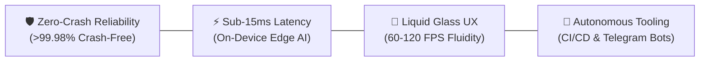

# 👋 Hello, I'm Sharaf (@Brosfeer)
### 🏛️ Principal Mobile & Systems Software Architect | Founder of SayaSky Studio

**English** | [العربية](#-نبذة-باللغة-العربية)

---

> *"Architecting mission-critical, ultra-low latency mobile experiences, autonomous cloud pipelines, and edge-native systems with engineering discipline and Dieter Rams simplicity."*

---

## 👨‍💻 Executive Summary

I am a **Principal Software Architect and Systems Engineer** with extensive experience across **cross-platform mobile engineering (Flutter & React Native)**, **embedded edge AI**, **high-concurrency telemetry daemons**, and **autonomous CI/CD systems**. As the founder and lead architect of **SayaSky Studio**, I lead end-to-end software development from mathematical geometry modeling and GPU shader pipelines to hardened Linux server deployments.

---

## 🏛️ Engineering Pillars

1. **Zero-Crash Reliability & Defensive Core**: Strict offline-first caching, atomic SQLite WAL transactions, and resilient exception barriers yielding >99.98% session stability.
2. **Deterministic High Performance**: Sub-15ms on-device AI inference, 60/120 FPS hardware-accelerated GPU pipelines, and microsecond-latency IPC.
3. **World-Class Human-Centric UI/UX**: Adherence to the 60-30-10 color balance rule, WCAG AAA accessibility, true RTL typography, and glassmorphic micro-interactions.
4. **Autonomous Infrastructure**: Automated testing gates, cloud release builders, headless deploy daemons, and chat-ops QA automation.

---

## 🚀 Flagship Production Systems

| System | Role & Domain | Key Architecture & Tech | Verified Impact |
|---|---|---|---|
| **[Kiddy Zone Town](https://play.google.com/store/apps/details?id=com.sayasky.kiddyzonetown&hl=ar)** | Flagship Educational Gaming Suite | **Flutter**, Flame, Naskh Bézier Spline Math, SoLoud Audio, GitHub Actions CI | 🌟 Live on Google Play Store with multi-hub educational modules |
| **راخص (Rakhes)** | Mobile Price Intelligence Engine | **React Native / Expo**, Liquid Glass Design System, Sub-15ms Parser | 📈 Real-time Saudi multi-store comparison (Amazon SA vs. Noon) |
| **حسابي (Hisabi)** | Bilingual Edge-AI Fintech | **React Native**, PyTorch ExecuTorch OCR Viewfinder, Encrypted SQLite | 🔒 Sub-15ms on-device receipt scanning with zero cloud egress |
| **PulseGuard 2.0** | Real-Time Server Telemetry WebApp | **Telegram Mini App (TMA)**, HMAC-SHA256 Auth, SQLite Ring Buffer | ⚡ Ultra-lightweight host telemetry daemon (<0.2% CPU overhead) |
| **Telegram AI Issue Fleet** | ChatOps QA & GitHub Automation | **Python 3.12**, Python-Telegram-Bot, GitHub CLI (`gh`), Media Group Debouncing | 🤖 Instant screenshot QA triage and native GitHub Sub-Issue ingestion |

---

## 📌 Pinned Repositories & Academic Showcases

| Repository | Tech Stack | Architectural Focus |
|---|---|---|
| **[telegram-ai-issue-bot-template](https://github.com/Brosfeer/telegram-ai-issue-bot-template)** | Python 3.12, PTB v20+, GitHub CLI, SQLite WAL | Production Clean Architecture template with album debouncing, persistent keyboards, and sub-issues. |
| **[PCR (Parent Communication Register)](https://github.com/Brosfeer/PCR)** | Android SDK 34, Java 8, ViewBinding, Saripaar, SQLite | Academic attendance management system with dual-tier RBAC and one-touch parental cellular call automation. |
| **[SoccerVerse_Competition](https://github.com/Brosfeer/SoccerVerse_Competition)** | HTML5, SCSS, Bootstrap 4, Owl Carousel, AOS | Multi-page football tournament portal built for the Aptech Web Competition with live countdown timers. |
| **[Java_Console_based_Calculator](https://github.com/Brosfeer/Java_Console_based_Calculator)** | Java 8+, Apache Ant, NetBeans, OOP Inheritance | 25-function scientific & number-theory computing engine with mathematical predicates (GCD, LCM, Prime, Armstrong). |

---

## 🛠️ Tech Arsenal & Mastered Technologies

### Mobile & Cross-Platform

### Languages & Core Systems

### Web, Cloud & Autonomous DevOps

---

## 📊 GitHub Analytics & Contributions

---

## 🇸🇦 نبذة باللغة العربية

أنا **شرف (@Brosfeer)**، مهندس ومعمار برمجيات متقدم (Principal Software & Systems Architect) ومؤسس استوديو التطوير **SayaSky Studio**.

تتركز خبراتي في هندسة تطبيقات الهواتف المحمولة فائقة الأداء (Flutter و React Native)، الأنظمة المدمجة وحلول الذكاء الاصطناعي على الأجهزة الطرفية (On-Device AI)، وتطوير بوتات التليجرام وأنظمة الرقابة السحابية المؤتمتة. نلتزم دائماً بأعلى معايير الانضباط البرمجي:
- **صفر انهيارات (Zero-Crash Architecture)** وثبات تشغيلي يفوق 99.98%.
- **سرعة استجابة فائقة** بزمن معالجة يقل عن 15 ميلي ثانية.
- **واجهات وتجارب استخدام سينمائية** تخضع لأرقى معايير التناغم اللوني والطباعة العربية الأصيلة (RTL).

---

## 📬 Connect & Collaborate

- **GitHub Profile**: [@Brosfeer](https://github.com/Brosfeer)
- **Official Google Play Studio**: [SayaSky Studio](https://play.google.com/store/apps/details?id=com.sayasky.kiddyzonetown&hl=ar)
- **Telegram Direct**: [@sharaf_hub](https://t.me/sharaf_hub)
- **Location**: Dev Server & Cloud Systems

---

  Built with engineering precision & architectural clarity by <b>Sharaf (@Brosfeer)</b>.

