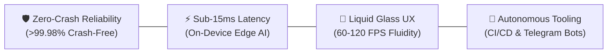

# 👋 Hello, I'm Sharaf (@Brosfeer)
### 🏛️ Principal Mobile & Systems Software Architect | Founder of SayaSky Studio

**English** | [العربية](#-نبذة-تعريفية-وتنفيذية)

---

> *"Architecting mission-critical, ultra-low latency mobile experiences, autonomous cloud pipelines, and edge-native systems with engineering discipline and Dieter Rams simplicity."*

---

## 👨‍💻 Executive Summary

I am a **Principal Software Architect and Systems Engineer** with extensive experience across **cross-platform mobile engineering (Flutter & React Native / Expo)**, **embedded edge AI**, **high-concurrency telemetry daemons**, and **growth-driven mobile infrastructure**. As the founder and lead architect of **SayaSky Studio**, I design resilient end-to-end architectures—from mathematical geometry modeling and GPU shader pipelines to hardened production growth stacks: **Firebase Suite (Auth, Crashlytics)**, **advanced telemetry & attribution (Google Analytics, AppsFlyer ROAS)**, **deferred deep linking**, and **instant zero-downtime deployments via Expo EAS Over-The-Air (OTA) updates**.

---

## 🇸🇦 نبذة تعريفية وتنفيذية

أنا **شرف (@Brosfeer)**، مهندس ومعماري برمجيات ونُظم رئيسي (**Principal Software & Systems Architect**) ومؤسس استوديو **SayaSky Studio**.

أقود هندسة وتطوير تطبيقات الجوال المتقدمة والأنظمة الرقمية المتكاملة، جامعاً بين متانة الهندسة البرمجية الصارمة (**Clean Architecture**) ودقة محركات النمو والتحليلات التسويقية. تمتد خبراتي الإنتاجية عبر منظومات **Flutter** و **React Native / Expo**، حلول الذكاء الاصطناعي الطرفي المدمج (**On-Device Edge AI**)، والبنى التحتية السحابية المؤتمتة.

أمتلك خبرة عملية راسخة في إدارة البنية التحتية التشغيلية وهندسة دورة حياة التطبيقات بعد الإطلاق (**App Lifecycle & Growth Stack**):
- 🔐 **منظومة Firebase المتكاملة**: إدارة وتأمين الهويات والتوثيق المتقدم (**Firebase Auth**)، مراقبة الأداء اللحظي، وإدارة استقرار التطبيقات عبر التتبع الجنائي الدقيق للانهيارات والأخطاء بواسطة **Crashlytics**.
- 📊 **تحليلات النمو والإحالة التسويقية (Attribution & Analytics)**: إعداد وربط منصات التحليل الرائدة (**Google Analytics / GA4**) ومحركات إسناد الحملات الإعلانية ومعدل العائد على الإنفاق الإعلاني (**AppsFlyer ROAS**) لفهم وتوجيه سلوك المستخدم بدقة.
- 🔗 **مسارات التحويل والروابط العميقة (Deep Linking)**: بناء وهندسة الروابط الشاملة الذكية (**Universal Links & Deferred Deep Links**) لضمان تجارب انتقال سلسة ترفع معدلات التفاعل وإعادة الاستقطاب (*User Retention*).
- 🚀 **التحديثات الهوائية الفورية (OTA Delivery)**: اعتماد وتطبيق استراتيجيات النشر والتحديث السحابي عبر الهواء (**Expo EAS Over-The-Air Updates**) لدفع الميزات العاجلة ومعالجة الثغرات لحظياً دون انتظار فترات مراجعة المتاجر.

ألتزم دائماً بمبادئي الهندسية الأربعة:
- 🛡️ **استقرار تشغيلي قياسي (Zero-Crash Reliability)** بنسبة ثبات تتجاوز **99.98%**.
- ⚡ **معالجة واستجابة فائقة السرعة** بزمن تأخير يقل عن **15ms** ومعدل إطارات سينمائي (**60-120 FPS**).
- 🎨 **واجهات مستخدم زجاجية عصرية (Liquid Glass)** تراعي التناغم اللوني والطباعة العربية الأصيلة (**RTL**).
- 🤖 **أتمتة كاملة (Autonomous DevOps)** لخطوط الاختبار، النشر، وروبوتات الدعم عبر تيليجرام.

---

## 🏛️ Engineering Pillars

1. **Zero-Crash Reliability & Defensive Core**: Strict offline-first caching, atomic SQLite WAL transactions, and resilient exception barriers yielding >99.98% session stability.
2. **Deterministic High Performance**: Sub-15ms on-device AI inference, 60/120 FPS hardware-accelerated GPU pipelines, and microsecond-latency IPC.
3. **World-Class Human-Centric UI/UX**: Adherence to the 60-30-10 color balance rule, WCAG AAA accessibility, true RTL typography, and glassmorphic micro-interactions.
4. **Autonomous Infrastructure**: Automated testing gates, cloud release builders, headless deploy daemons, and chat-ops QA automation.

---

## 🚀 Flagship Production Systems

| System | Role & Domain | Key Architecture & Tech | Verified Impact |
|---|---|---|---|
| **[Kiddy Zone Town](https://play.google.com/store/apps/details?id=com.sayasky.kiddyzonetown&hl=ar)** | Flagship Educational Gaming Suite | **Flutter**, Flame, Naskh Bézier Spline Math, SoLoud Audio, GitHub Actions CI | 🌟 Live on Google Play Store with multi-hub educational modules |
| **راخص (Rakhes)** | Mobile Price Intelligence Engine | **React Native / Expo**, Liquid Glass Design System, Sub-15ms Parser | 📈 Real-time Saudi multi-store comparison (Amazon SA vs. Noon) |
| **حسابي (Hisabi)** | Bilingual Edge-AI Fintech | **React Native**, PyTorch ExecuTorch OCR Viewfinder, Encrypted SQLite | 🔒 Sub-15ms on-device receipt scanning with zero cloud egress |
| **PulseGuard 2.0** | Real-Time Server Telemetry WebApp | **Telegram Mini App (TMA)**, HMAC-SHA256 Auth, SQLite Ring Buffer | ⚡ Ultra-lightweight host telemetry daemon (<0.2% CPU overhead) |
| **Telegram AI Issue Fleet** | ChatOps QA & GitHub Automation | **Python 3.12**, Python-Telegram-Bot, GitHub CLI (`gh`), Media Group Debouncing | 🤖 Instant screenshot QA triage and native GitHub Sub-Issue ingestion |

---

## 🛠️ Tech Arsenal & Mastered Technologies

### Mobile & Cross-Platform

### Languages & Core Systems

### Web, Cloud & Autonomous DevOps

### Mobile Infrastructure & Growth Stack

---

## 📊 GitHub Analytics & Contributions

---

## 📬 Connect & Collaborate

- **GitHub Profile**: [@Brosfeer](https://github.com/Brosfeer)
- **Official Google Play Studio**: [SayaSky Studio](https://play.google.com/store/apps/details?id=com.sayasky.kiddyzonetown&hl=ar)
- **Telegram Direct**: [@sharaf_hub](https://t.me/sharaf_hub)
- **Location**: Dev Server & Cloud Systems

---

  Built with engineering precision & architectural clarity by <b>Sharaf (@Brosfeer)</b>.

