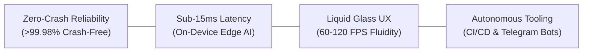

# Sharaf (@Brosfeer)
### Principal Mobile & Systems Software Architect | Founder of SayaSky Studio

**English** | [العربية](#نبذة-تعريفية-وتنفيذية)

---

> *"Architecting mission-critical, ultra-low latency mobile experiences, autonomous cloud pipelines, and edge-native systems with engineering discipline and Dieter Rams simplicity."*

---

## Executive Summary

I am **Sharaf (@Brosfeer)**, Principal Software & Systems Architect and founder of **SayaSky Studio**.

I engineer high-performance mobile applications and digital systems, pairing **Clean Architecture** with on-device intelligence and business growth telemetry. My production stack spans **Flutter** and **React Native / Expo**, on-device edge AI, and autonomous cloud infrastructure.

**Engineering Methodology, Security & Growth Stack:**
- **Architectural Discipline (Think Before Code)**: Planning systems, analyzing edge cases, and designing data pipelines before implementation to eliminate rework and ensure right-first-time delivery.
- **Cross-Functional Team Collaboration**: Working seamlessly with product managers, UI/UX designers, and backend teams through clear documentation, structured PR reviews, and technical mentorship.
- **System & API Integration**: Seamless integration of complex backend APIs, cloud services (REST, GraphQL, WebSockets), and third-party native SDKs with robust type safety, error boundaries, and resilient retry policies.
- **Security & Anti-Abuse**: Cryptographic client attestation via Firebase App Check, API rate limiting, and least-privilege permission auditing for rapid store compliance.
- **Offline-First Resilience**: Fault-tolerant caching via TanStack Query and local SQLite WAL persistence for zero-downtime continuity during backend disruptions.
- **Behavioral Analytics & Recommendations**: Telemetry instrumentation (catalog browsing, cart hesitation, user affinity) powering personalization engines and AOV conversion.
- **Attribution & Deep Linking**: Telemetry integration (Google Analytics GA4, AppsFlyer ROAS) paired with Universal & Deferred Deep Linking for seamless campaign acquisition.
- **Zero-Downtime Delivery**: Instant over-the-air updates via Expo EAS OTA to deploy urgent features and emergency triage without store review latency.

**Architectural Value & Delivery:**
- **ROAS & Acquisition Protection**: Aligning deep linking with marketing attribution so paid traffic routes directly to target purchase screens without drop-offs.
- **Commercial Agility**: Zero-downtime over-the-air releases deployed in minutes, preserving revenue and operational continuity during peak campaigns.
- **Edge AI Cost Efficiency**: Sub-15ms on-device inference eliminating recurring cloud compute bills while ensuring complete user privacy.
- **Full Ownership & Scalability**: Taking ambiguous product requirements to production-grade, million-user systems without technical debt.

---

## نبذة تعريفية وتنفيذية

أنا **شرف (@Brosfeer)**، مهندس برمجيات ومعماري نُظم أول (Principal Software & Systems Architect) ومؤسس استوديو **SayaSky Studio**.

أقود تطوير وهندسة تطبيقات الجوال والأنظمة الرقمية عالية الأداء، بالاعتماد على المعمارية النظيفة (Clean Architecture)، تقنيات الذكاء الاصطناعي المدمج، وهندسة نمو المنتجات. تمتد خبرتي العملية عبر تطوير تطبيقات Flutter و React Native / Expo، نماذج الذكاء الاصطناعي على الأجهزة الطرفية (On-Device Edge AI)، والبنية التحتية السحابية وأتمتة العمليات (DevOps / CI/CD).

**المنهجية الهندسية، الأمان، وإدارة دورة حياة التطبيقات:**
- **التخطيط المعماري المسبق (Think Before Code)**: دراسة بنية النظام، تحليل حالات الاستخدام المعقدة (Edge Cases)، واختيار الحلول الأنسب قبل كتابة الكود لضمان التنفيذ الصحيح من المرة الأولى وتجنب إعادة العمل.
- **التعاون وقيادة الفرق التقنية (Team Collaboration)**: العمل بمرونة وانسجام مع مدراء المنتجات، مصممي الواجهات، ومطوري الباك إند، مع مراجعة دقيقة للأكواد (Code Reviews) وتوثيق معماري واضح.
- **تكامل الأنظمة وربط الـ APIs (System & API Integration)**: خبرة عميقة في ربط وتكامل مختلف الـ APIs والخدمات السحابية (REST, GraphQL, WebSockets) وحزم الـ SDKs المخصصة، مع بناء طبقات حماية ومعالجة متقدمة للأخطاء (Error Boundaries & Retries).
- **أمان التطبيقات وحماية الـ APIs (Security & Anti-Abuse)**: تفعيل التحقق من موثوقية التطبيق عبر Firebase App Check لمنع الطلبات المزيفة وهجمات البوتات، حماية السيرفرات من الضغط المفتعل (Rate Limiting)، وتطبيق مبدأ الحد الأدنى من الصلاحيات (Least Privilege) لتسريع القبول في المتاجر.
- **تطبيقات تعمل بلا إنترنت واستمرارية الخدمة (Offline-First)**: تصميم التطبيق ليعمل بسلاسة حتى عند تعطل السيرفرات أو ضعف الشبكة، عبر التخزين المؤقت الذكي (TanStack Query) وقواعد بيانات SQLite WAL المحلية، لضمان استمرار تجربة المستخدم دون توقف أو فقدان للبيانات.
- **تحليلات سلوك المستخدم ومحركات التوصية**: تتبع مسار تفاعل المستخدمين (الأقسام الأكثر تصفحاً، والمنتجات المفضلة، وسلات الشراء) لتغذية محركات التوصية الذكية ورفع معدلات إتمام الشراء (Conversion Rate) ومتوسط قيمة السلة (AOV).
- **تتبع الحملات التسويقية والروابط الذكية (Attribution & Deep Links)**: ربط منصات التحليل (Google Analytics و AppsFlyer) وهندسة الروابط الذكية (Universal & Deep Links) لتوجيه المستخدمين مباشرة من الإعلانات الخارجية إلى صفحات المنتجات المطلوبة.
- **النشر الفوري عبر الهواء (Over-The-Air Updates)**: إطلاق الإصلاحات العاجلة والميزات الجديدة لحظياً عبر Expo EAS OTA دون الحاجة لانتظار دورات المراجعة في App Store و Google Play.

**القيمة الهندسية وأثر الأعمال (Business & ROI Impact):**
- **تعظيم العائد من الإنفاق الإعلاني (ROAS)**: هندسة رحلة المستخدم داخل التطبيق لمنع خروج الزوار قبل الشراء، وضمان وصول زوار الحملات الإعلانية إلى شاشة الدفع بأقل عدد من النقرات.
- **سرعة الاستجابة التشغيلية وتفادي التوقف**: إمكانية إطلاق التحديثات ومعالجة أي خطأ طارئ أثناء الحملات التسويقية الكبرى في دقائق وبشكل غير ملحوظ للمستخدم (Zero Downtime).
- **تقليل تكاليف الخوادم بالذكاء الاصطناعي المحلي (Edge AI)**: تشغيل النماذج ومعالجة البيانات على هاتف المستخدم (<15ms)، مما يوفر تكاليف السيرفرات السحابية ويضمن خصوصية كاملة لبيانات العملاء.
- **إدارة وتطوير شامل للمنتج (End-to-End Ownership)**: استلام أفكار ومتطلبات المشروع وتحويلها إلى تطبيقات إنتاجية جاهزة للتوسع المليوني، مع بناء كود نظيف يمنع الأخطاء الهيكلية ويغني عن أي إعادة بناء مستقبلية.

---

## Engineering Pillars

1. **Zero-Crash Reliability & Defensive Core**: Strict offline-first caching, atomic SQLite WAL transactions, and resilient exception barriers yielding >99.98% session stability.
2. **Deterministic High Performance**: Sub-15ms on-device AI inference, 60/120 FPS hardware-accelerated GPU pipelines, and microsecond-latency IPC.
3. **World-Class Human-Centric UI/UX**: Adherence to the 60-30-10 color balance rule, WCAG AAA accessibility, true RTL typography, and glassmorphic micro-interactions.
4. **Autonomous Infrastructure**: Automated testing gates, cloud release builders, headless deploy daemons, and chat-ops QA automation.

---

## Flagship Production Systems

| System | Role & Domain | Key Architecture & Tech | Verified Impact |
|---|---|---|---|
| **[Kiddy Zone Town](https://play.google.com/store/apps/details?id=com.sayasky.kiddyzonetown&hl=ar)** | Flagship Educational Gaming Suite | **Flutter**, Flame, Naskh Bézier Spline Math, SoLoud Audio, GitHub Actions CI | Live on Google Play Store with multi-hub educational modules |
| **راخص (Rakhes)** | Mobile Price Intelligence Engine | **React Native / Expo**, Liquid Glass Design System, Sub-15ms Parser | Real-time Saudi multi-store comparison (Amazon SA vs. Noon) |
| **حسابي (Hisabi)** | Bilingual Edge-AI Fintech | **React Native**, PyTorch ExecuTorch OCR Viewfinder, Encrypted SQLite | Sub-15ms on-device receipt scanning with zero cloud egress |
| **PulseGuard 2.0** | Real-Time Server Telemetry WebApp | **Telegram Mini App (TMA)**, HMAC-SHA256 Auth, SQLite Ring Buffer | Ultra-lightweight host telemetry daemon (<0.2% CPU overhead) |
| **Telegram AI Issue Fleet** | ChatOps QA & GitHub Automation | **Python 3.12**, Python-Telegram-Bot, GitHub CLI (`gh`), Media Group Debouncing | Instant screenshot QA triage and native GitHub Sub-Issue ingestion |

---

## Tech Arsenal & Production Stack

### Mobile & Cross-Platform

### Languages & Core Systems

### Web, Cloud & Autonomous DevOps

### Mobile Infrastructure & Growth Stack

---

## GitHub Analytics & Contributions

---

## Connect & Collaborate

- **GitHub Profile**: [@Brosfeer](https://github.com/Brosfeer)
- **Official Google Play Studio**: [SayaSky Studio](https://play.google.com/store/apps/details?id=com.sayasky.kiddyzonetown&hl=ar)
- **Telegram Direct**: [@sharaf_hub](https://t.me/sharaf_hub)
- **Location**: Dev Server & Cloud Systems

---

  Built with engineering precision & architectural clarity by <b>Sharaf (@Brosfeer)</b>.

